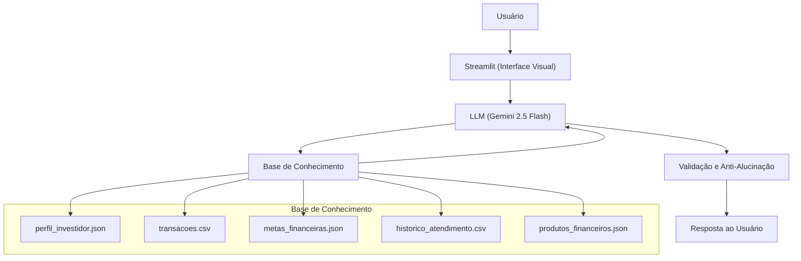
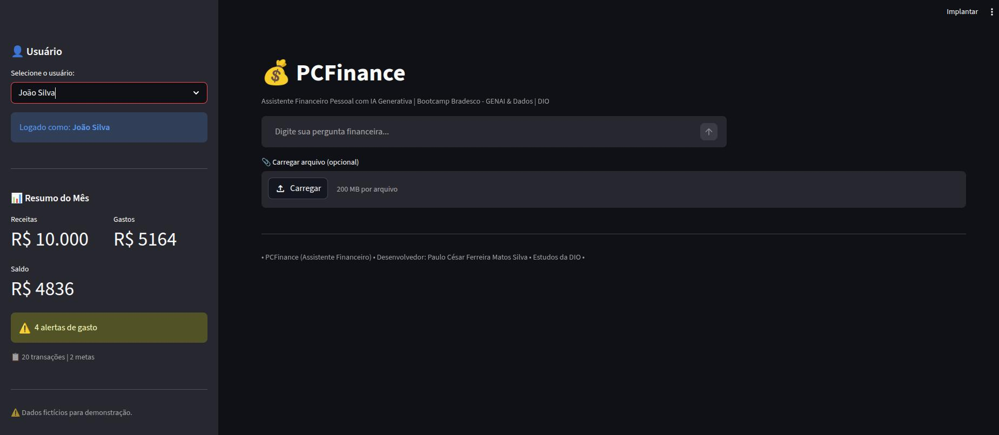
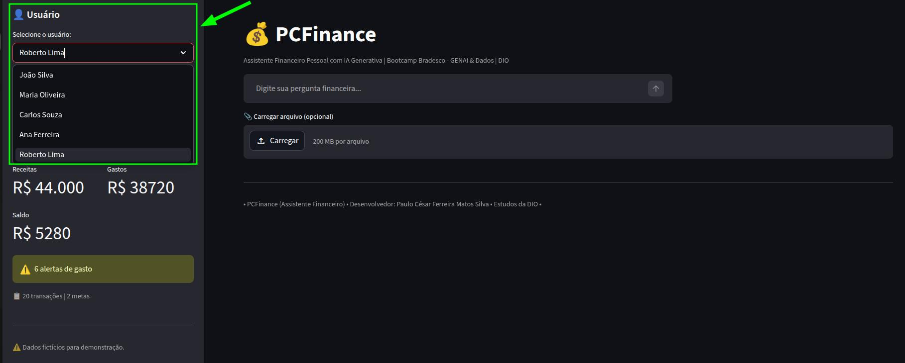
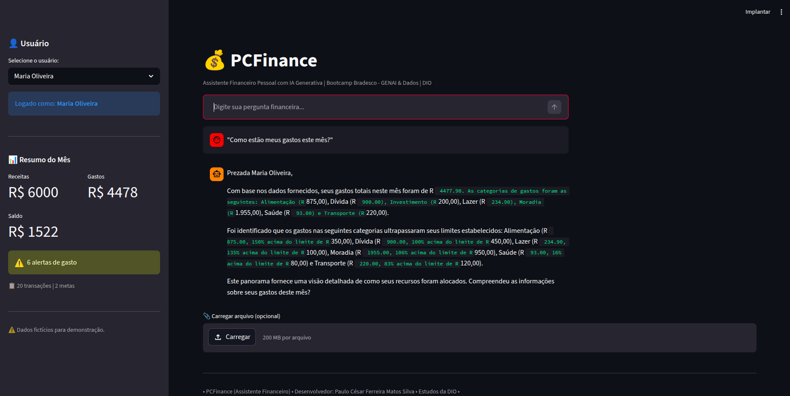
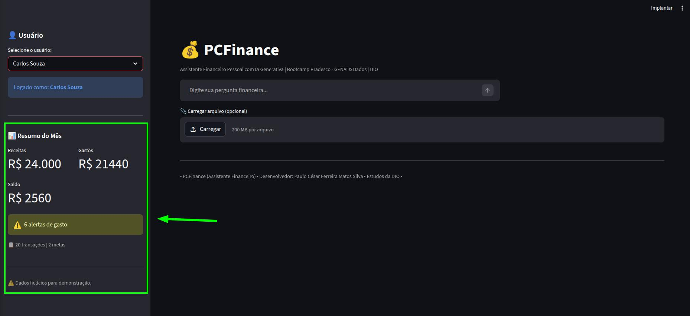

# 💰 PCFinance - Assistente Financeiro Inteligente


> Agente de IA Generativa focado em controle de gastos e planejamento de metas financeiras pessoais, desenvolvido como parte do **Bootcamp Bradesco - GENAI & Dados** na [DIO](https://www.dio.me/).

## 💡 O Que é o PCFinance?

O PCFinance é um assistente financeiro pessoal que orienta usuários no controle de gastos, planejamento de metas e educação financeira básica. Utiliza os dados reais do usuário logado como contexto dinâmico para gerar respostas personalizadas e alertas inteligentes.

**O que o PCFinance faz:**
- ✅ Monitora gastos por categoria e emite alertas quando os limites são ultrapassados
- ✅ Acompanha o progresso de metas financeiras com valores e percentuais
- ✅ Explica conceitos financeiros básicos de forma acessível
- ✅ Suporta múltiplos usuários com histórico isolado por sessão
- ✅ Exibe métricas de latência e consumo de tokens em tempo real

**O que o PCFinance NÃO faz:**
- ❌ Não recomenda investimentos específicos
- ❌ Não acessa dados bancários sensíveis
- ❌ Não compartilha dados entre usuários
- ❌ Não substitui um profissional financeiro certificado

## 🏗️ Arquitetura



**Stack:**
- Interface: [Streamlit](https://streamlit.io/)
- LLM: Gemini 2.5 Flash via [Google AI API](https://ai.google.dev/)
- Dados: JSON/CSV mockados com 5 perfis de usuários
- Segurança: API Key protegida via variável de ambiente `.env`

## 📁 Estrutura do Projeto

```
dio-lab-bia-do-futuro/
│
├── data/
│   ├── perfil_investidor.json      # Perfis dos 5 usuários
│   ├── transacoes.csv              # Transações por usuário (2 meses)
│   ├── historico_atendimento.csv   # Histórico de atendimentos
│   ├── metas_financeiras.json      # Metas e limites por categoria
│   └── produtos_financeiros.json  # Produtos financeiros disponíveis
│
├── docs/
│   ├── 01-documentacao-agente.md  # Caso de uso e persona
│   ├── 02-base-conhecimento.md    # Estratégia de dados
│   ├── 03-prompts.md              # System prompt e exemplos
│   ├── 04-metricas.md             # Avaliação de qualidade
│   └── 05-pitch.md                # Apresentação do projeto
│
├── src/
│   ├── app.py                     # Aplicação Streamlit
│   └── README.md                  # Instruções de execução
│
├── .env.example                   # Exemplo de configuração da API Key
├── .gitignore                     # Ignora .env e arquivos sensíveis
└── README.md                      # Este arquivo
```

## 🚀 Como Executar

### 1. Configurar a API Key

Crie um arquivo `.env` na raiz do projeto:

```
GEMINI_API_KEY=sua_key_aqui
```

> 🔑 Obtenha sua key gratuita em [aistudio.google.com](https://aistudio.google.com)  
> ⚠️ Nunca suba o arquivo `.env` para o repositório!

### 2. Instalar Dependências

```bash
pip install streamlit pandas google-genai python-dotenv
```

### 3. Rodar a Aplicação

```bash
streamlit run src/app.py
```

## 🎯 Exemplos de Uso

**Pergunta:** "Como estão meus gastos este mês?"  
**PCFinance:** "Com base nas suas transações de outubro, seus gastos com alimentação estão 36% acima do limite definido (R$ 475,00 vs R$ 350,00). Considerando sua meta de quitar o cartão até março/2026, uma redução nessa categoria liberaria R$ 125,00 mensais para acelerar o pagamento. Gostaria de entender como reorganizar esse ajuste?"

**Pergunta:** "Qual o progresso da minha reserva de emergência?"  
**PCFinance:** "Sua reserva de emergência está em R$ 10.000,00 de um total de R$ 15.000,00 (66,7%). Com o aporte mensal atual de R$ 500,00, você atingirá a meta em aproximadamente 10 meses, dentro do prazo de junho/2026. Deseja revisar o valor do aporte?"

## 📊 Métricas e Avaliação

| Métrica | Objetivo |
|---------|----------|
| **Assertividade** | O agente respondeu o que foi perguntado? |
| **Segurança** | Evitou inventar informações (anti-alucinação)? |
| **Coerência** | A resposta considerou o perfil e contexto do usuário? |

## 📸 Demonstração

Abaixo estão exemplos visuais da aplicação em funcionamento:

### 🏠 Tela Inicial
Interface principal do PCFinance com seleção de usuário e visão geral.



---

### 👤 Seleção de Usuário
Escolha de diferentes perfis com dados financeiros distintos.



---

### 💬 Interação com o Assistente / 🤖 Resposta da IA
Usuário realizando uma pergunta financeira.
Resposta personalizada baseada no contexto financeiro do usuário.



---

### 📊 Métricas Financeiras
Resumo mensal com receitas, gastos e saldo.



### 🎥 Demonstração em Vídeo

[🎥 Assistir ao pitch](https://www.loom.com/share/1e65228b3a7f4f08aa81bdf3185e9c20)


## 🎬 Diferenciais em Relação ao Projeto Original

| Item | Original (Edu) | PCFinance |
|------|---------------|-----------|
| LLM | Ollama (local) | Gemini 2.5 Flash (API) |
| Usuários | 1 usuário fixo | 5 usuários selecionáveis |
| Histórico | Compartilhado | Isolado por usuário |
| Metas | Não tinha | `metas_financeiras.json` |
| Alertas de gastos | Manual | Calculados automaticamente |
| Métricas | Não tinha | Receitas-Gastos-Saldo na Tela inical |
| Foco | Educação financeira | Controle de gastos e metas |
| Upload de Arquivos | Não tinha | Campo para Uploads na Página Principal |
| Tom | Informal | Formal |

## 🔮 Melhorias Futuras

- **Integração com MySQL** (PCFinance - Senac): substituir os CSVs mockados por consultas SQL ao banco de dados real, com persistência de conversas via tabela de logs
- **Autenticação real**: substituir o seletor de usuário por login com senha
- **Gráficos de gastos**: visualizações interativas por categoria e período com Plotly
- **Monitoramento avançado**: integração com LangWatch ou LangFuse para análise de qualidade em escala

## 📝 Documentação Completa

Toda a documentação técnica está disponível na pasta [`docs/`](./docs/).